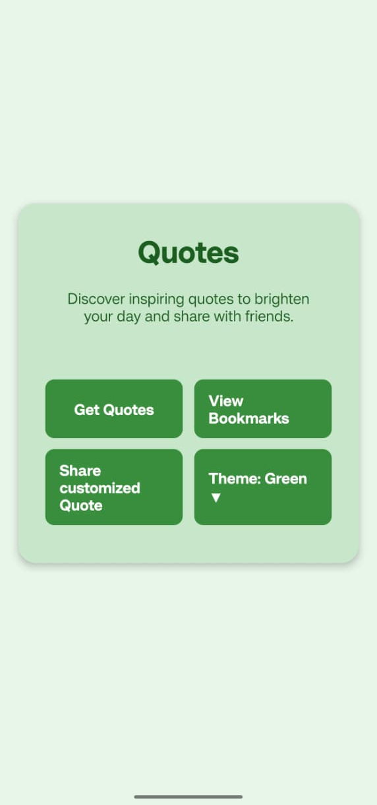
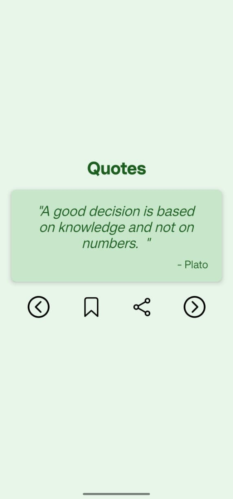
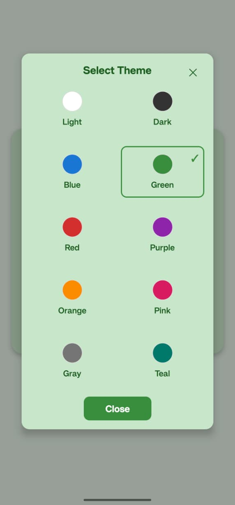
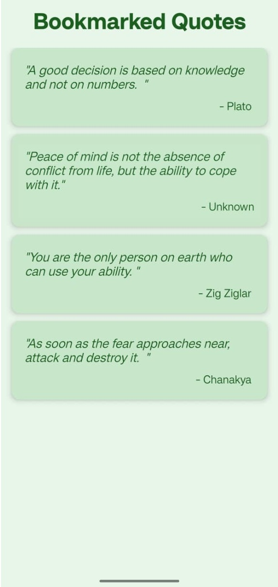
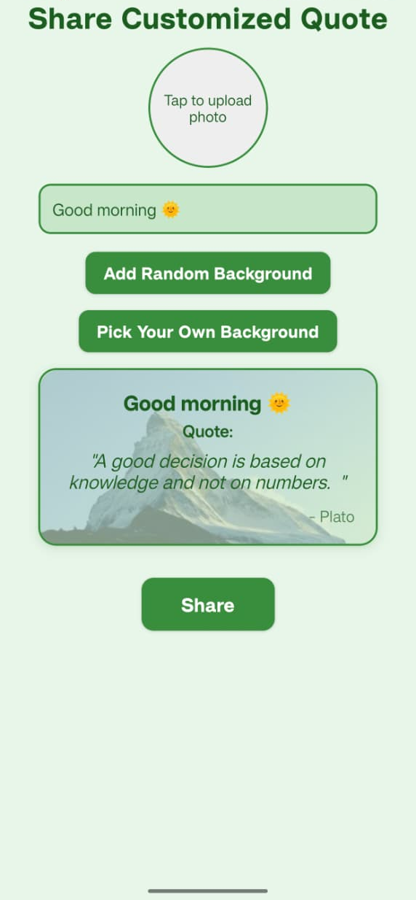

# Quotes App

A clean, delightful, and highly customizable quotes app for daily inspiration.
**NO sign-up**
**NO advertizements**
**NO user data collection**

just pure content!

## Highlights
- **Simple & Direct:** Dive straight into content without any sign-up or login process.
- **Stunning UI:** Experience a clean, neat, and intuitive user interface designed for beauty and ease of use.
- **Personalized Themes:** Choose from 10 vibrant color themes that instantly transform the entire application to match your style.
- **Bookmark & Organize:** Easily bookmark your favorite quotes and revisit them anytime in a dedicated section.
- **Advanced Sharing:** Share quotes as text or create beautiful custom images with various backgrounds (photo, random, picker), auto-resizing text, and personalized greetings.

## Features
- Explore a curated collection of inspiring quotes.
- View detailed quotes and author information.
- Bookmark quotes for quick access.
- Share quotes as text.
- Create customizable image shares:
    - Add a photo.
    - Select a random background image.
    - Choose a background from a picker.
    - Image automatically resizes based on quote length.
    - Add custom greeting or text to your shared image.
- Simple, offline-friendly caching for a smooth experience.

## Disclaimer
Quotes in this app are sourced from public online services. The app does not own, endorse, or guarantee the accuracy of the content. By downloading / using this app, you agree that you understand and accept this.

